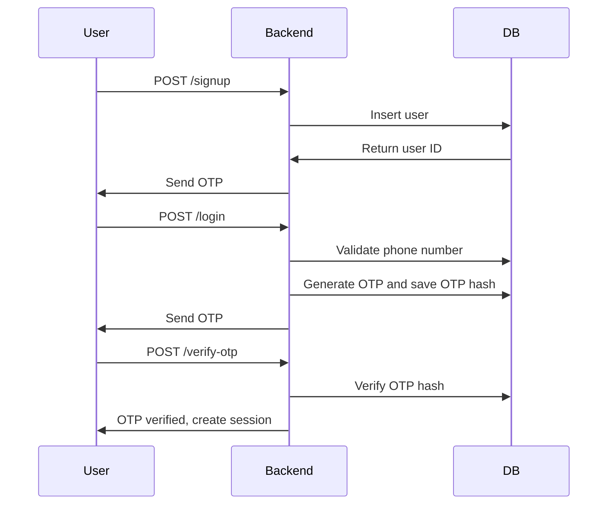
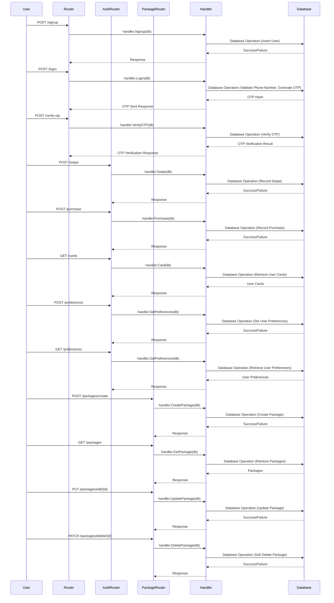

# Dating Mobile App Backend

## Project Description

This project is a backend system for a dating mobile app similar to Tinder/Bumble. The system includes functionalities such as sign-up, login, profile swiping, premium package purchases, and package management. This backend is built using Golang and includes a RESTful API service for these functionalities.

## Prerequisites

- Golang 1.22.x
- PostgreSQL
- Git

## Tech Stack

- **Golang**: The primary programming language used for the backend.
- **PostgreSQL**: Database to store user information, swipes, purchases, etc.
- **Gorilla Sessions**: For handling user sessions.
- **Swaggo**: For generating API documentation.
- **bcrypt**: For hashing OTPs.
- **httpSwagger**: For serving the Swagger UI.

## Project Setup Guide

This guide helps you set up the necessary environment to run the project locally.

### Database Setup

Follow these steps to set up the PostgreSQL database:

- **Install PostgreSQL:**

  - **Linux:**

    ```bash
    sudo apt install postgresql postgresql-contrib
    ```

  - **Mac (using Homebrew):**

    ```bash
    brew install postgresql
    ```

  - **Windows:**
  - Download PostgreSQL:
    Download PostgreSQL version 16.2 from [EnterpriseDB](https://www.enterprisedb.com/downloads/postgres-postgresql-downloads).

  - Installation Process:

    - Uncheck "Stack Builder" when prompted to select components to save time.
    - Use port 5432 when prompted for port selection.
    - Set the temporary password for the superuser as "123123123" when prompted.

- **Start PostgreSQL service:**

  - **Linux and Mac:**

    ```bash
    sudo systemctl start postgresql.service
    ```

  - **Windows:**
    Start PostgreSQL service from the Services panel.

- **Create a PostgreSQL role and database:**

  - **Linux and Mac:**
    To create a PostgreSQL role and database on Linux and Mac, execute the following commands in your terminal:

    ```bash
    sudo -u postgres psql -c "CREATE ROLE root WITH SUPERUSER CREATEDB CREATEROLE PASSWORD '123123123';”
    sudo -u postgres createdb -O root dating_app
    ```

  - **Windows:**
    After PostgreSQL installation:

    - Create a user/role named "root" with the password "123123123".
    - Create a database (not a schema) named "dating_app".

    For detailed instructions, you can refer to this guide: [How to Create PostgreSQL Database and Users using psql and pgAdmin](https://www.enterprisedb.com/postgres-tutorials/how-create-postgresql-database-and-users-using-psql-and-pgadmin).

### Setup PostgreSQL Database

Create tables using the provided SQL script

```sql
CREATE  TABLE users (
  id SERIAL  PRIMARY  KEY,
  phone_number VARCHAR(15) UNIQUE NOT  NULL,
  is_premium BOOLEAN DEFAULT FALSE,
  verified BOOLEAN DEFAULT FALSE,
  is_deleted BOOLEAN DEFAULT FALSE,
  signup_at TIMESTAMP DEFAULT CURRENT_TIMESTAMP,
  login_at TIMESTAMP,
  logout_at TIMESTAMP,
  created_at TIMESTAMP DEFAULT CURRENT_TIMESTAMP,
  updated_at TIMESTAMP DEFAULT CURRENT_TIMESTAMP
);

CREATE  TABLE profiles (
  id SERIAL  PRIMARY  KEY,
  user_id  INT  REFERENCES users(id),
  name  VARCHAR(50),
  age INT,
  bio TEXT,
  photo_url TEXT,
  created_at TIMESTAMP DEFAULT CURRENT_TIMESTAMP,
  updated_at TIMESTAMP DEFAULT CURRENT_TIMESTAMP
);

CREATE  TABLE otp_auth (
  id SERIAL  PRIMARY  KEY,
  user_id  INT  REFERENCES users(id),
  otp_hash VARCHAR(60) NOT  NULL,
  created_at TIMESTAMP DEFAULT CURRENT_TIMESTAMP,
  updated_at TIMESTAMP DEFAULT CURRENT_TIMESTAMP
);

CREATE  TABLE swipes (
  id SERIAL  PRIMARY  KEY,
  swiper_id INT  REFERENCES users(id),
  profile_id INT  REFERENCES users(id),
  swipe_type VARCHAR(10),
  swipe_date TIMESTAMP DEFAULT CURRENT_TIMESTAMP,
  created_at TIMESTAMP DEFAULT CURRENT_TIMESTAMP,
  updated_at TIMESTAMP DEFAULT CURRENT_TIMESTAMP
);

CREATE  TABLE purchases (
  id SERIAL  PRIMARY  KEY,
  user_id  INT  REFERENCES users(id),
  purchase_date TIMESTAMP DEFAULT CURRENT_TIMESTAMP,
  created_at TIMESTAMP DEFAULT CURRENT_TIMESTAMP,
  updated_at TIMESTAMP DEFAULT CURRENT_TIMESTAMP
);

CREATE  TABLE preferences (
  id SERIAL  PRIMARY  KEY,
  user_id  INT  REFERENCES users(id),
  date_mode BOOLEAN DEFAULT FALSE,
  bff_mode BOOLEAN DEFAULT FALSE,
  preferred_gender VARCHAR(10),
  min_age INT,
  max_age INT,
  created_at TIMESTAMP DEFAULT CURRENT_TIMESTAMP,
  updated_at TIMESTAMP DEFAULT CURRENT_TIMESTAMP
);


CREATE  TABLE packages (
  id SERIAL  PRIMARY  KEY,
  name  VARCHAR(50) NOT  NULL,
  feature TEXT  NOT  NULL,
  price FLOAT  NOT  NULL,
  currency VARCHAR(10) NOT  NULL,
  is_deleted BOOLEAN DEFAULT FALSE,
  created_at TIMESTAMP DEFAULT CURRENT_TIMESTAMP,
  updated_at TIMESTAMP DEFAULT CURRENT_TIMESTAMP
);

```

#### Table Purpose and Sequence

- users: Stores user information and is the primary entity for user-related operations.
- profiles: Stores user profile details such as name, age, bio, and photo URL.
- otp_auth: Stores OTP hashes for user authentication.
- swipes: Records swipes made by users (left or right).
- purchases: Records purchases of premium memberships.
- preferences: Stores user preferences for matching (e.g., preferred gender, age range).
- packages: Stores information about available premium packages.

#### Clone the Repository

```sh
git  clone  git@github.com:andregit1/dating_app.git
cd  dating_app
```

#### Install Dependencies

```sh
go get -u github.com/gorilla/sessions
go get -u github.com/lib/pq
go get -u github.com/swaggo/http-swagger
go get -u golang.org/x/crypto/bcrypt
```

#### Prepare

```sh
swag init
go mod tidy
```

#### Run the Server

```sh
go run main.go
```

#### Swagger Documentation

Access the API documentation at http://localhost:8080/swagger/index.html.

#### RESTful API Endpoints

- Public Endpoints

  - POST /signup: Register a new user.

  - POST /login: Login and get OTP.

  - POST /verify-otp: Verify OTP and create a session.

- Authenticated Endpoints

  - POST /swipe: Swipe left or right on a profile.

  - POST /purchase: Purchase premium membership.

  - GET /cards: Retrieve users based on preferences.

  - Package Management Endpoints

    - POST /packages/create: Create a new package.

    - GET /packages: Retrieve all packages.

    - PUT /packages/edit/{id}: Update an existing package.

    - PATCH /packages/delete/{id}: Soft delete a package.

#### Running Tests [in progress]

Unit tests can be added in the \*\_test.go files and executed using:

```sh
go  test  ./...
```

#### Sequence Diagram

This sequence diagram demonstrates the interaction between the components for the login flow:



This sequence diagram for complete user interaction:



#### Functional Requirements

- User can sign up using their phone number.

- User can login using their phone number and OTP.

- User can only view and swipe 10 profiles per day.

- Premium users have no swipe quota and can have a verified label.

- Users cannot see the same profile more than once in a day.

##### Non-Functional Requirements

- Scalability: The system should handle a large number of users and swipes.

- Security: OTPs should be securely hashed, and user sessions should be managed securely.

- Performance: The system should respond quickly to user actions.

##### Test Cases

- Signup Tests: Verify that a new user can sign up with a valid phone number.

- Login Tests: Verify that a user can login and receive an OTP.

- OTP Verification Tests: Verify that OTP verification works correctly.

- Swipe Tests: Ensure that users cannot exceed their daily swipe limit and cannot swipe the same profile twice - in a day.

- Purchase Tests: Verify that purchasing premium membership updates the user status correctly.

- Package Tests: Verify that CRUD operations on packages work correctly.

#### Future enhancement
